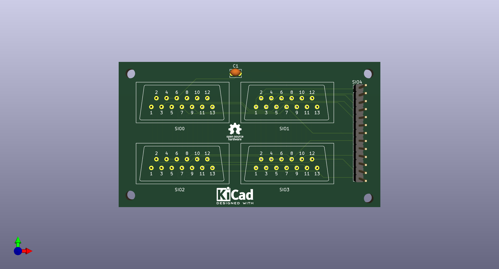

# Atari-SIOHUB
Hub/Splitter para conexión SIO de Atari

* Puntas del conector: AT60-202-2031, alternativa en aliexpress 0460-202-20141
* Los símbolos de atari tomados desde https://github.com/pmandes/atari-sio-connector

